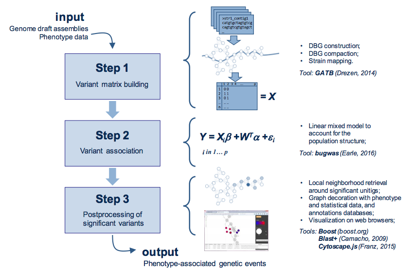
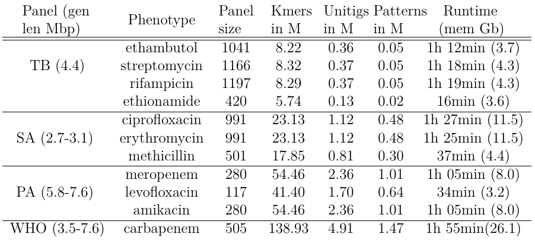
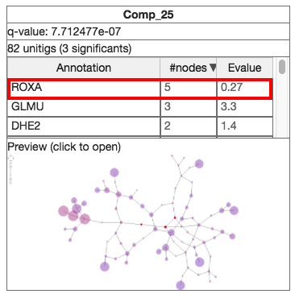
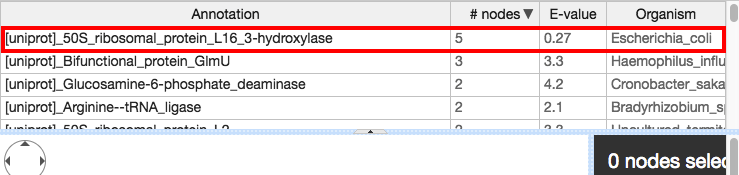

# About DBGWAS
DBGWAS is a tool for quick and efficient bacterial GWAS. It uses a compacted De Bruijn Graph (cDBG) structure to represent the variability within all bacterial genome assemblies given as input. Then cDBG nodes are tested for association with a phenotype of interest and the resulting associated nodes are then re-mapped on the cDBG. The output of DBGWAS consists of regions of the cDBG around statistically significant nodes with several informations related to the phenotypes, offering a representation helping in the interpretation. The output can be viewed with any modern web browser, and thus easily shared.

## DBGWAS pipeline
DBGWAS takes as input draft assemblies and phenotype data for a panel of
bacterial strains. Variant matrix `X` is built in step 1 using cDBG nodes.
Variants are tested in step 2 using a linear mixed model.
Significant variants are post-processed in step 3 to provide an interactive
interface assisting their interpretation.




**IMPORTANT: DBGWAS ONLY WORKS ON LINUX FOR THE MOMENT.**

**IMPORTANT: DBGWAS' OUTPUT IS ONLY TESTED WITH GOOGLE CHROME, FIREFOX AND OPERA BROWSERS.**

# DBGWAS in a nutshell

For a quick example on how DBGWAS works, we provide the output
obtained from 282 bacterial genomes along with their drug (amikacin) resistance/sensitivity
phenotype.

Genomes are taken from van Belkum A et al., "Phylogenetic Distribution
of CRISPR-Cas Systems in Antibiotic-Resistant Pseudomonas
aeruginosa.", MBio, 2015 Nov 24;6(6):e01796-15

Phenotypes are taken from Jaillard M at al. ,"Correlation between
phenotypic antibiotic susceptibility and the resistome in Pseudomonas
aeruginosa". IJAA , 50 (2017) 210-218.

The graph nodes were annotated with a resistance database composed by four sources (ResFinders, MEGAres, ArgAnnot and CARD) and the UniProt database of bacterial proteins (http://www.uniprot.org/).

The output can be found here: http://leoisl.gitlab.io/DBGWAS_support/full_dataset_visualization/

For reproducibility reasons, in the following you have easily the input data, annotation databases and command-line to generate the above output:

1. Strains' sequences along with DBGWAS' required files (input): https://www.dropbox.com/s/0g1llvdbfv1jys6/pseudomonas_aeruginosa_full_dataset.zip?dl=1
2. Resistance database: https://www.dropbox.com/s/mt3g4oh0bt5jwmr/Resistance_DB_for_DBGWAS.fasta?dl=1
3. UniProt database: https://www.dropbox.com/s/9y1p0yw918ips6k/uniprot_sprot_bacteria_for_DBGWAS.fasta?dl=1
4. Extract everything in the bin folder and execute DBGWAS as:
```
./DBGWAS -strains pseudomonas_aeruginosa_full_dataset/strains -newick pseudomonas_aeruginosa_full_dataset/strains.newick -nc_db Resistance_DB_for_DBGWAS.fasta -pt_db uniprot_sprot_bacteria_for_DBGWAS.fasta
```
5. After finishing the execution, the output can be found in the folder ```bin/output/visualisations```

# Downloading, installing and running
## Downloading the precompiled binaries
This is the easiest way to run the tool since it is already precompiled for Linux AMD64 machines.
Download the latest binary here (v0.5.0): https://www.dropbox.com/s/qr1ew7jdfieodt0/DBGWAS-0.5.0-Linux-precompiled.tar.gz?dl=1

Pre-compiled versions history:

DBGWAS v0.4.8: https://www.dropbox.com/s/bp81xqohgyfl8ed/DBGWAS-0.4.8-Linux-precompiled.tar.gz?dl=1

DBGWAS v0.4.7: https://www.dropbox.com/s/bb6uk0qw8r7018n/DBGWAS-0.4.7-Linux-precompiled.tar.gz?dl=1

DBGWAS v0.4.6: https://www.dropbox.com/s/fmttm0dhv1bq5ms/DBGWAS-0.4.6-Linux-precompiled.tar.gz?dl=1

DBGWAS v0.4.5: https://www.dropbox.com/s/3yow59j0f5onnb7/DBGWAS-0.4.5-Linux-precompiled.tar.gz?dl=1

DBGWAS v0.4.4: https://www.dropbox.com/s/ncf6ef4pwyzzuog/DBGWAS-0.4.4-Linux-precompiled.tar.gz?dl=1

DBGWAS v0.4.3: https://www.dropbox.com/s/6b7toss7h4ql6vi/DBGWAS-0.4.3-Linux.tar.gz?dl=1

DBGWAS v0.4.2: https://www.dropbox.com/s/k67eym0b0koo84h/DBGWAS-0.4.2-Linux.tar.gz?dl=1

DBGWAS v0.4.1: https://www.dropbox.com/s/k4kq6e7xz23qu65/DBGWAS-0.4.1-Linux.tar.gz?dl=1

DBGWAS v0.4.0: https://www.dropbox.com/s/q52b1xbvfy55acm/DBGWAS-0.4.0-Linux.tar.gz?dl=1

DBGWAS v0.3.7: https://www.dropbox.com/s/cl3ai2bybqyor2g/DBGWAS-0.3.7-Linux.tar.gz?dl=1


## Compiling
If you still want to compile, clone the repository:
```
git clone --recursive https://gitlab.com/leoisl/dbgwas.git
```
and build the package:
```
cd dbgwas && mkdir build && cd build && cmake .. && make && make package
```


## Dependencies installation
DBGWAS uses several thirdparty libraries, but most of them were already packed and were statically linked during compilation, so almost no dependencies are needed. However, you still need to:

1. Install bugwas (an R package). Execute these commands:

```
R
install.packages("ape")
install.packages("phangorn")
install.packages("https://raw.githubusercontent.com/sgearle/bugwas/master/build/bugwas_1.0.tar.gz", repos=NULL, type="source")
```

## Running on a sample example

Now that everything is installed, let's try running the tool in a
sample example comprising 50 bacterial genomes (subset of the 282
described in the "DBGWAS in a nutshell" section):

1. Go to the binary folder:
```
cd bin/
```
2. Execute the program, using demo files:
```
./DBGWAS -strains ../sample_example/strains -newick ../sample_example/strains.newick
```
3. The main output, which are subgraphs that can be visualised with any modern web browser, can be found in ```bin/output/visualisations/index.html```
4. For help and understanding the parameters:
```
./DBGWAS -h
```
5. See also the directory ```sample_example``` to understand better this example;
Check at least the file ```sample_example/strains``` to know how to build the input to the program.

## Parameters

You can find DBGWAS parameters by running ```./DBGWAS -h``` or simply here:
```
       -strains  (1 arg) :    A text file describing the strains containing 3 columns: 1) ID of the strain; 2) Phenotype (0/1/NA); 3) Path to a multi-fasta file containing the sequences of the strain. This file needs a header. Check the sample_example folder or https://gitlab.com/leoisl/dbgwas/raw/master/sample_example/strains for an example.
       -k        (1 arg) :    K-mer size.  [default '31']
       -newick   (1 arg) :    Optional path to a newick tree file. If (and only if) a newick tree file is provided, the lineage effect analysis is computed and PCs figures are generated.  [default '']
       -nc_db    (1 arg) :    A list of Fasta files separated by comma containing annotations in a nucleotide alphabet format (e.g.: -nc_db path/to/file_1.fa,path/to/file_2.fa,etc). You can customize these files to work better with DBGWAS (see https://gitlab.com/leoisl/dbgwas/tree/master#customizing-annotation-databases).  [default '']
       -pt_db    (1 arg) :    A list of Fasta files separated by comma containing annotations in a protein alphabet format (e.g.: -pt_db path/to/file_1.fa,path/to/file_2.fa,etc). You can customize these files to work better with DBGWAS (see https://gitlab.com/leoisl/dbgwas/tree/master#customizing-annotation-databases).  [default '']
       -output   (1 arg) :    Path to the folder where the final and temporary files will be stored.  [default 'output']
       -skip1    (0 arg) :    Skips Step 1, running only Steps 2 and 3. Assumes that Step 1 was correctly run and folder "step1" is present in the output folder.
       -skip2    (0 arg) :    Skips Steps 1 and 2, running only Step 3. Assumes that Steps 1 and 2 were correctly run and folders "step1" and "step2" are present in the output folder.
       -SFF      (1 arg) :    Denotes the Significant Features Filter - the features (or patterns) selected to create a visualisation around them. If it is a float number n, then only the features with q-value<=n are selected. If it is an integer n, then only the n first features are selected. Take a look at the output/step2/patterns.txt file to get a list of features ordered by q-value to better choose this parameter (re-run the tool with -skip2 in order to directly produce the visualisation of the features selected by your parameter).  [default '100']
       -nh       (1 arg) :    Denotes the neighbourhood to be considered around the significant unitigs.  [default '5']
       -maf      (1 arg) :    Minor Allele Frequency Filter.  [default '0.01']
       -nb-cores (1 arg) :    number of cores  [default '1']
       -verbose  (1 arg) :    verbosity level  [default '1']
       -version  (0 arg) :    version
       -help     (0 arg) :    help
```

## Lineage vs locus effect

DBGWAS is based on bugwas, which is described in the following paper:

Sarah Earle et al., "Identifying lineage effects when controlling for
population structure improves power in bacterial association studies",
Nature Microbiology 2016.

Bugwas offers association tests at the "locus" level (SNPs, kmers, or
in our case unitigs) or at the lineage level, i.e. groups of
SNPs/kmers/unitigs represented by a principal component of the full
design matrix. The latter option needs more memory as it requires a
PCA step. If a newick tree file is provided to DBGWAS (with parameter ```-newick```)
then the lineage effect analysis is computed. Otherwise, it is skipped.

## Memory and CPU requirements

The analysis on the full dataset with 280 P. aeruginosa strains and amikacin resistance phenotype,
described in section "DBGWAS in a nutshell",
produces 54,397,312 kmers which are compressed
into 2,356,052 unitigs corresponding to 1,141,877 unique patterns.

On a machine with 8 Intel(R) Xeon(R) CPU E5-2620 v3 @ 2.40GHz cores, the analysis runs in:

* 56 minutes and has 8Gb memory usage peak if the newick tree file and the annotation DBs are not given (lineage effect analysis and annotations are skipped);
* 80 minutes and has 13.6Gb memory usage peak if the newick tree file and the annotation DBs are given (lineage effect analysis and annotations are processed);

A more comprehensive test is presented below. DBGWAS time and maximal memory load on a **single core** is shown (memory between parenthesis). All
runs were executed with the default parameters, without optional steps (lineage effect analysis
nor annotation of subgraphs), on an Intel(R) Xeon(R) CPU E5-1620 v3 processor.



Scaling on new datasets will essentially depend on the number of
strains and the number of unique presence/absence patterns obtained
across unitigs, i.e., on the genetic variability in the dataset.


# Customizing annotation databases

You can customize annotation databases to work better with DBGWAS. For example, consider this Fasta line in the UniProt database of bacterial proteins:
```
>sp|P27431|ROXA_ECOLI 50S ribosomal protein L16 3-hydroxylase OS=Escherichia coli (strain K12) GN=roxA PE=1 SV=2
MEYQLTLNWPDFLERHWQKRPVVLKRGFNNFIDPISPDELAGLAMESEVDSRLVSHQDGK
WQVSHGPFESYDHLGETNWSLLVQAVNHWHEPTAALMRPFRELPDWRIDDLMISFSVPGG
GVGPHLDQYDVFIIQGTGRRRWRVGEKLQMKQHCPHPDLLQVDPFEAIIDEELEPGDILY
```
If DBGWAS finds a hit to this line, it will consider the full header as its identifier, which can be too long to be shown, making the visualisation cumbersome. More worrying is that this long identifier can be too specific to show general informations, like in the summary page.

If you wish to give new IDs to existing registries without changing much the database, in order to make the visualisation better, and also to group different annotations in the summary page, you can add some tags to the headers of the database in the following format:
```
DBGWAS_general_tag=<value>;
DBGWAS_specific_tag=<value>;
DBGWAS_xyz_tag=<value>;
```

```DBGWAS_general_tag``` will be the value shown for this annotation in the summary page.

```DBGWAS_specific_tag``` will be the value shown for this annotation in the graph page. **It is advised that ```DBGWAS_specific_tag``` to be unique.**

```DBGWAS_xyz_tag``` will be a column ```xyz``` added to the annotation table in the graph page to make it easier to analyse the annotations found by DBGWAS. With this tag, you could specify, for example, from which organism the annotation comes. There are no limits on the number of ```DBGWAS_xyz_tag``` one can use.


For example, if we add three tags to our previous example (scroll to the right to see the tags):
```
>sp|P27431|ROXA_ECOLI 50S ribosomal protein L16 3-hydroxylase OS=Escherichia coli (strain K12) GN=roxA PE=1 SV=2;DBGWAS_general_tag=ROXA;DBGWAS_specific_tag=[uniprot] 50S ribosomal protein L16 3-hydroxylase;DBGWAS_Organism_tag=Escherichia coli
MEYQLTLNWPDFLERHWQKRPVVLKRGFNNFIDPISPDELAGLAMESEVDSRLVSHQDGK
WQVSHGPFESYDHLGETNWSLLVQAVNHWHEPTAALMRPFRELPDWRIDDLMISFSVPGG
GVGPHLDQYDVFIIQGTGRRRWRVGEKLQMKQHCPHPDLLQVDPFEAIIDEELEPGDILY
```

This is what we get in the summary page:



And this is what we get in the graph page:




# Thirdparties
DBGWAS makes use of several thirdparty libraries:
1. GATB (https://github.com/GATB/gatb-core)
2. Boost C++ Libraries (http://www.boost.org/)
3. Bugwas (https://github.com/sgearle/bugwas)
4. GEMMA (https://github.com/genetics-statistics/GEMMA)
5. Blast (https://blast.ncbi.nlm.nih.gov/Blast.cgi)
6. Cytoscape.js (http://js.cytoscape.org/) and these extensions:
   1. cytoscape.js-cxtmenu (https://github.com/cytoscape/cytoscape.js-cxtmenu)
   2. cytoscape-ngraph.forcelayout (https://github.com/Nickolasmv/cytoscape-ngraph.forcelayout)
   3. cytoscape.js-panzoom (https://github.com/cytoscape/cytoscape.js-panzoom)
7. PhantomJS (http://phantomjs.org/)
8. PStreams (http://pstreams.sourceforge.net/)
9. Where Am I? (https://github.com/gpakosz/whereami)
10. Alasql (https://github.com/agershun/alasql)
11. Handsontable (https://github.com/handsontable/handsontable)
12. Bootstrap (http://getbootstrap.com/javascript/)
13. jQuery (https://jquery.com/)
14. jQuery QueryBuilder (http://querybuilder.js.org/)
15. jQuery Layout (http://layout.jquery-dev.com/)
16. jQuery BlockUI Plugin (https://github.com/malsup/blockui/)
17. Shuffle.js (https://vestride.github.io/Shuffle/)
18. Fastclick (https://github.com/ftlabs/fastclick)


# How to cite
Magali Jaillard, Leandro Lima, Maud Tournoud, Pierre Mahé, Alex van Belkum, Vincent Lacroix, Laurent Jacob. A fast and agnostic method for bacterial genome-wide association studies: bridging the gap between kmers and genetic events. bioRxiv Cold Spring Harbor Labs Journals (2018). doi:10.1101/297754. URL: https://www.biorxiv.org/content/early/2018/04/09/297754.

# License
Copyright (C) <2017>  <bioMerieux, Universite Claude Bernard Lyon 1,
Centre National de la Recherche Scientifique>

1. This program is free software: you can redistribute it and/or modify
it under the terms of the GNU Affero General Public License as published
by the Free Software Foundation version 3 of the  License and under the
terms of article 2 below.

2. This program is distributed in the hope that it will be useful, but
WITHOUT ANY WARRANTY; without even the implied warranty of MERCHANTABILITY
or FITNESS FOR A PARTICULAR PURPOSE. See below the GNU Affero General Public License for more details.
You should have received a copy of the GNU Affero General Public License
along with this program.  If not, see <http://www.gnu.org/licenses/>.

3. Communication to the public by any means, in particular in the form of
a scientific paper, a poster, a slideshow, an internet page, or a patent,
of a result obtained directly or indirectly by running this program must
cite the following paper :

Magali Jaillard, Leandro Lima, Maud Tournoud, Pierre Mahé, Alex van Belkum, Vincent Lacroix, Laurent Jacob. A fast and agnostic method for bacterial genome-wide association studies: bridging the gap between kmers and genetic events. bioRxiv Cold Spring Harbor Labs Journals (2018). doi:10.1101/297754. URL: https://www.biorxiv.org/content/early/2018/04/09/297754.

# Affiliations:

bioMérieux (http://www.biomerieux.fr/)

LBBE (https://lbbe.univ-lyon1.fr/?lang=en)

Erable (https://team.inria.fr/erable/en/)